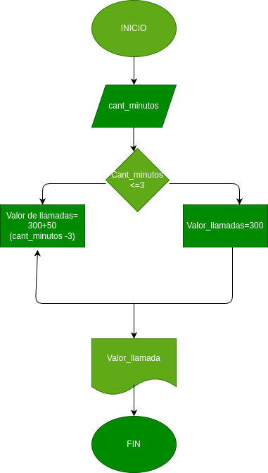

# Condicional_1
Condicionales #1
## Costo de una llamada telefonica

Ingresar el tiempode una llamada telefonica y determinar la cantidad a pagar de acuerdocon lo siguiente:
-Toda llamada que dure 3 minutos o menos, tiene un costo de trescientos pesos.
-Cada minuto adicional cuesta cincuenta pesos.

